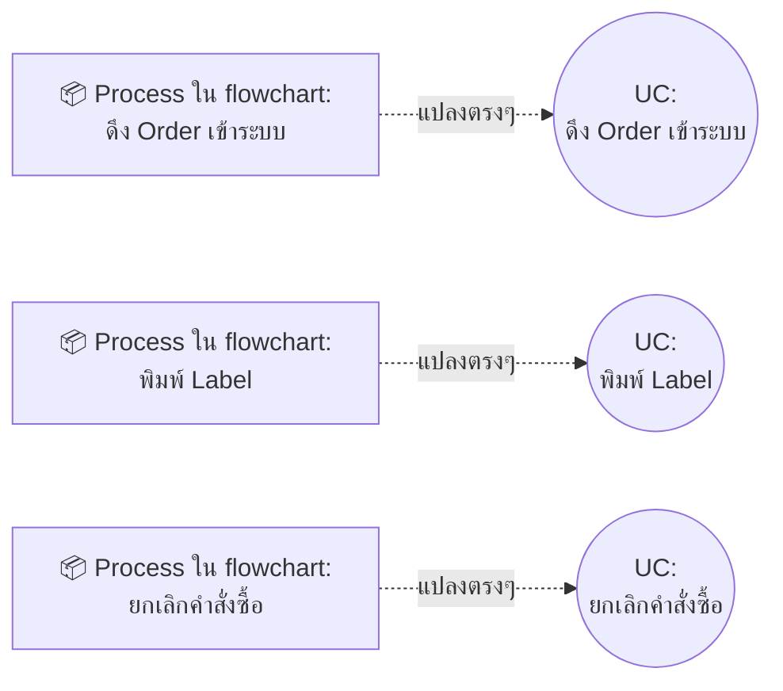
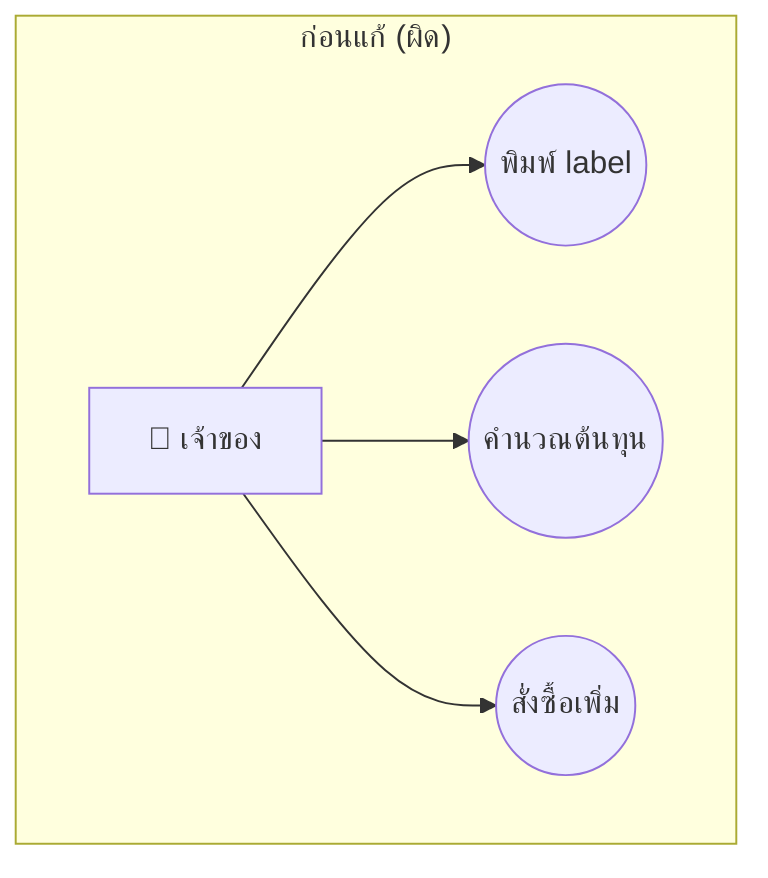
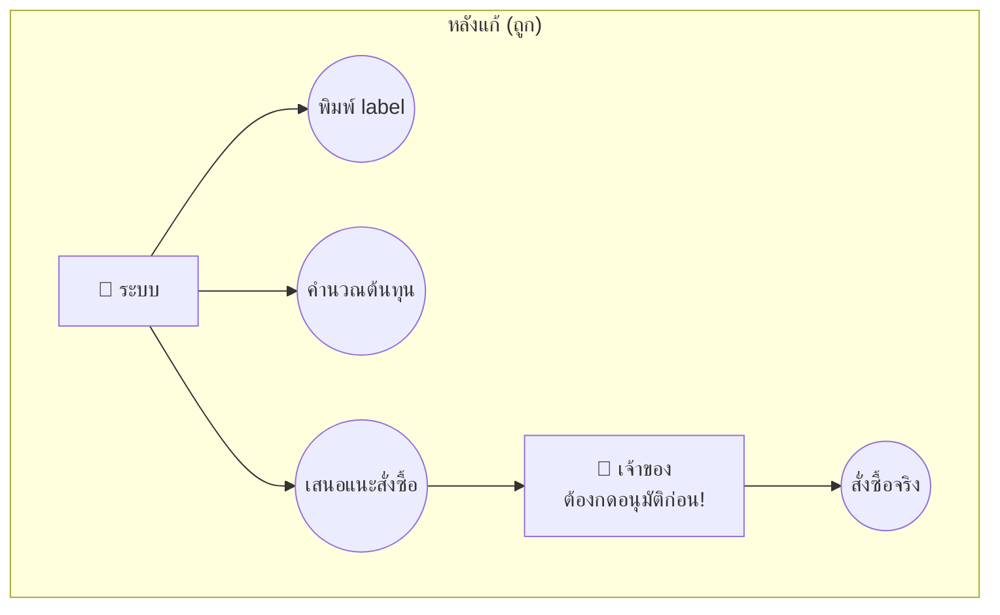
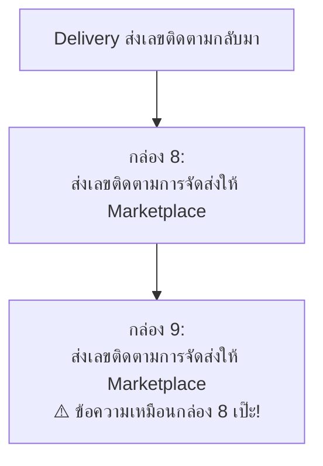
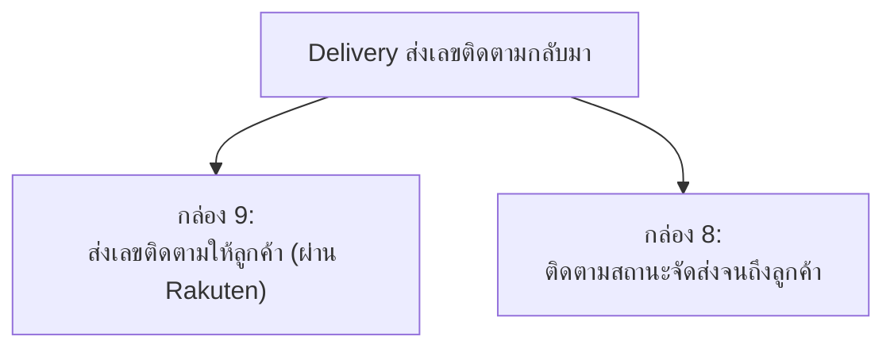

# วิธีทำ 3 งานนี้ (ฉบับอ่านง่าย 5 นาที)

อ่านไฟล์นี้ก่อน ถ้าอยากรู้รายละเอียด/เหตุผลลึกๆ ค่อยไปอ่าน [`01-use-case-diagram-fix-notes.md`](01-use-case-diagram-fix-notes.md) กับ [`02-biz-flow-fix-notes.md`](02-biz-flow-fix-notes.md)

## มี 3 งาน ทำตามลำดับนี้ ห้ามสลับ

| # | งาน | คืออะไร |
|---|---|---|
| 1 | **ทำรูปใหม่ 1 รูป** — `use-case-before.png` | ร่างแรกของ use case diagram (ยังไม่เคยทำ) |
| 2 | **แก้ `use-case.png`** ที่มีอยู่แล้ว | เวอร์ชันปรับปรุง แก้ไข 6 จุดที่ผิด |
| 3 | **แก้ `biz-flow-to-be.png` + `biz-flow-rel-use-case.png`** | ให้ชื่อ use case ตรงกับ flowchart หลังแก้งาน 2 เสร็จ |

## ก่อนอื่น ทำไมต้องทำ 3 อย่างนี้พร้อมกัน

- **`use-case-before.png` / `use-case.png`** = รูปวงรีๆ บอกว่า **"ใครทำอะไรได้บ้าง"** ในระบบ (ร่างแรก vs เวอร์ชันปรับปรุง)
- **`biz-flow-to-be.png` / `biz-flow-rel-use-case.png`** = รูป flowchart บอก **"ขั้นตอนการทำงานจริงเป็นยังไง"**

ทั้งหมดพูดเรื่องเดียวกัน แค่คนละมุม/คนละรอบความละเอียด ⇒ **ชื่อ use case ต้องตรงกับชื่อ process ในโฟลว์เป๊ะๆ** ถ้าไม่ตรง = ผิด

**ลำดับทำ: งาน 1 (ทำร่างแรก) → งาน 2 (แก้เป็นเวอร์ชันปรับปรุง) → งาน 3 (แก้ biz-flow ให้ตรงกัน)** ห้ามข้ามงาน 1 ไปทำงาน 3 เลย เพราะ biz-flow ต้องอ้างอิงชื่อ UC เวอร์ชันสุดท้ายจากงาน 2

---

## งานที่ 1: ทำ `use-case-before.png` (ร่างแรก — ยังไม่เคยทำ)

นี่คือ use case diagram แบบ**ง่ายที่สุด** ทำก่อน `use-case.png` (ที่มีอยู่แล้ว) เพื่อโชว์ว่า "ก่อนปรับปรุง" หน้าตาเป็นยังไง

### วิธีทำ

1. เปิดรูป **`biz-flow-to-be.png`** (flowchart) ไว้ข้างๆ
2. ไล่ดูทีละกล่อง (process) ในแต่ละ swimlane — **แปลงกล่องเป็น use case ตรงๆ** 1 กล่อง = 1 use case
3. ผูก use case กับ actor ของ swimlane นั้น (เจ้าของ/Super Admin, Delivery, Marketplace, Supplier)
4. **ยังไม่ต้องคิดเรื่อง auto/manual หรือ human-in-the-loop** — ทำแบบตรงไปตรงมาที่สุดก่อน ไม่ต้องสวย ไม่ต้องรวม/แยกอะไรซับซ้อน

### ทำไมต้องทำร่างที่ "ไม่สมบูรณ์" แบบนี้ด้วย?

เพราะอาจารย์อยากเห็นว่า "ก่อนปรับปรุง" (งานนี้) กับ "หลังปรับปรุง" (งานที่ 2 — `use-case.png`) **ต่างกันตรงไหน** — ร่างแรกนี้จะดูไม่ครบ/มีจุดผิดเยอะ เป็นเรื่องปกติ ไม่ต้องพยายามทำให้ถูกตั้งแต่รอบแรก เดี๋ยวงานที่ 2 จะเป็นตัวที่แก้ให้ถูก

---

## งานที่ 2: แก้ `use-case.png` (เวอร์ชันปรับปรุง — มีอยู่แล้วแต่ต้องแก้)

### ปัญหาหลัก: งานที่ควร "อัตโนมัติ" ถูกวาดว่าเจ้าของทำเอง

ปัญหา: ทั้ง 3 อันนี้ควรเป็นงานที่ **ระบบทำเองอัตโนมัติ** (ตามที่ตั้งใจไว้ตั้งแต่แรก) แต่ในรูปกลับวาดให้เจ้าของเป็นคนกดเองหมด

**⚠️ จุดสำคัญที่สุด:** "สั่งซื้อเพิ่ม" **ห้าม** ทำอัตโนมัติ 100% เพราะเป็นเรื่องเงิน — อาจารย์คอมเม้นแล้วว่าต้องมีเจ้าของอนุมัติก่อนเสมอ (human-in-the-loop) ส่วน "พิมพ์ label" กับ "คำนวณต้นทุน" อัตโนมัติเต็มที่ได้เลย เพราะไม่เสียเงิน แก้ไขทีหลังได้

### สิ่งที่ต้องทำ (เรียงตามนี้)

1. เพิ่ม actor ใหม่ชื่อ **"ระบบ"** (วาดเป็นคนแท่งเหมือน actor อื่นก็ได้)
2. ย้าย 4 อัน นี้จาก "เจ้าของ" ไปเป็น "ระบบ": **พิมพ์ label, คำนวณต้นทุน, เช็คสต๊อก, เสนอแนะสั่งซื้อ**
3. **"ตัดสินใจสั่งซื้อ" (อนุมัติ) ให้อยู่กับ "เจ้าของ" เหมือนเดิม** — ห้ามย้าย นี่คือจุด human-in-the-loop
4. เพิ่ม use case ที่หายไป 2 อัน: **"รับออเดอร์ใหม่จาก Rakuten"** และ **"ตัดสต๊อกสินค้า"** (ใส่ไว้กับ actor "ระบบ")
5. เช็คชื่อซ้ำ: "อัพเดทสถานะการจัดส่ง" มีอยู่ 2 ที่ (ที่เจ้าของ กับที่ Marketplace) ต้องตั้งชื่อให้ไม่ซ้ำกัน เช่น ฝั่งเราเปลี่ยนเป็น "ส่งอัพเดทสถานะไปที่ Rakuten"
6. ชื่อยาวไป: "ตัดสินใจการสั่งซื้อสินค้ามาเติม Stock จากการคำนวณ Cost ที่ระบบคำนวณให้" → ย่อเหลือ **"อนุมัติคำสั่งซื้อเติมสต๊อก"**

---

## งานที่ 3: แก้ `biz-flow-to-be.png` + `biz-flow-rel-use-case.png`

ทำหลังจากงานที่ 2 (แก้ use-case.png) เสร็จแล้วเท่านั้น เพราะต้องใช้ชื่อ UC เวอร์ชันใหม่

### ปัญหา A: กล่องในโฟลว์มีข้อความซ้ำกัน 2 กล่อง

**แก้เป็น:** ให้ 2 กล่องนี้เขียนคนละเรื่องกัน เช่น

### ปัญหา B: ป้ายชื่อ UC ไม่ตรงกับสิ่งที่กล่องทำจริง

| ป้าย UC เขียนว่า | แต่กล่องข้างในทำเรื่อง | ต้องแก้ |
|---|---|---|
| "อัพเดท**สถานะการจัดส่ง**" | "Update **จำนวนสินค้า**ใน Marketplace" | เลือกให้ตรงกันอันใดอันหนึ่ง (แก้ชื่อ UC หรือแก้เนื้อกล่อง) |

### ปัญหา C: ชื่อ "จับคู่ Order กับ RSL" ถูกใช้ซ้ำ 2 ที่ (เลข UC 4 และ UC 12)

- UC4 = ใช้ถูกที่แล้ว (ครอบกล่อง "Match เลข RSL กับ order_id")
- UC12 = ใช้ผิด ควรเป็นชื่อ **"จับคู่ SKU"** แทน (เพราะกล่องที่มันครอบจริงๆ เกี่ยวกับ SKU ไม่ใช่ RSL)

### ปัญหา D: พิมพ์ชื่อผิด

มุมบนซ้ายของ `biz-flow-to-be.png` เขียนว่า **"f"** ตัวเดียว → แก้เป็น **"Marketplace"**

---

## เช็คลิสต์สั้นๆ ก่อนบอกว่าทำเสร็จ

**งานที่ 1 — use-case-before.png**
- [ ] ทำร่างแรกแล้ว (แปลงจาก biz-flow-to-be.png ตรงๆ ทุก process)

**งานที่ 2 — use-case.png**
- [ ] "ระบบ" เป็นคนทำ พิมพ์ label / คำนวณต้นทุน / เช็คสต๊อก / เสนอแนะสั่งซื้อ
- [ ] "เจ้าของ" ยังคงเป็นคนอนุมัติสั่งซื้อจริง (ห้ามเอาออก)
- [ ] เพิ่ม UC "รับออเดอร์ใหม่" กับ "ตัดสต๊อก" แล้ว

**งานที่ 3 — biz-flow**
- [ ] กล่อง 8-9 ไม่ซ้ำข้อความกันแล้ว
- [ ] ชื่อ UC ทุกอันตรงกับกล่องที่มันครอบ
- [ ] แก้ "f" เป็น "Marketplace" แล้ว
- [ ] "จับคู่ Order กับ RSL" เหลือแค่ 1 เลข (UC4) ส่วน UC12 เปลี่ยนเป็น "จับคู่ SKU"
