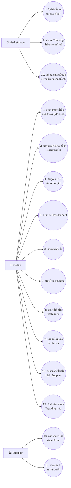
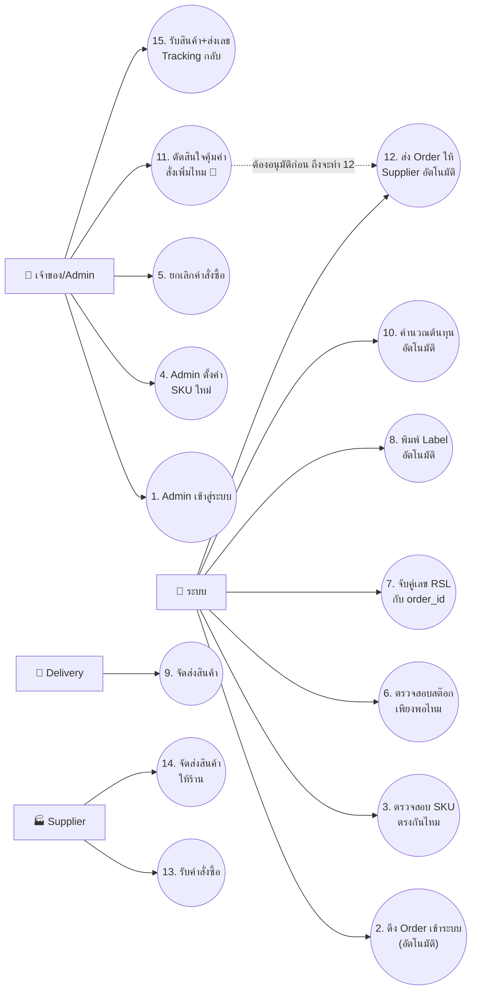
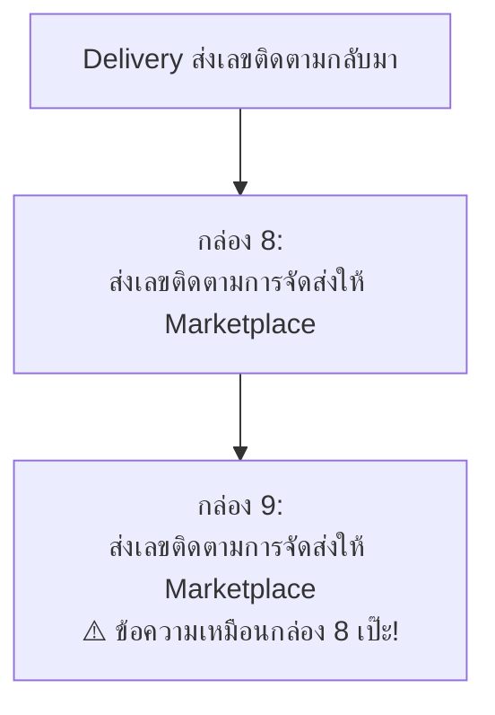
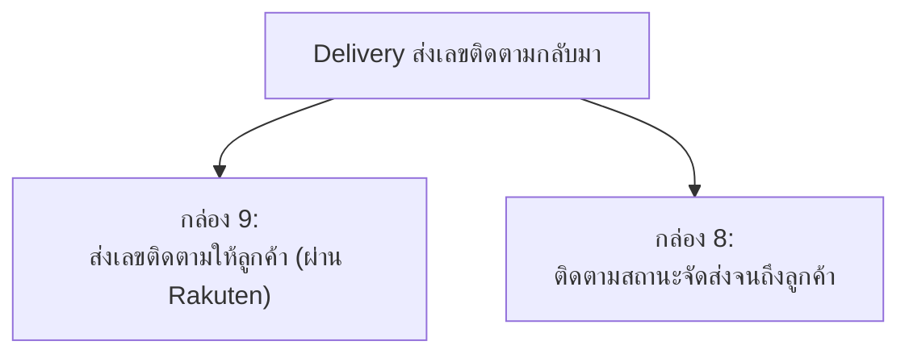

# วิธีทำ 3 งานนี้ (ฉบับอ่านง่าย)

> **อัปเดต:** เปลี่ยนมาใช้คำว่า **"As-Is" / "To-be"** ให้ตรงกับชื่อ tab ใน CRUD Table sheet ของทีม (`321-SA-proj-sheets`) เลิกใช้คำว่า "ก่อนปรับปรุง/หลังปรับปรุง" หรือ "before/after" แล้ว เพื่อไม่ให้งง

อ่านไฟล์นี้ก่อน ถ้าอยากรู้รายละเอียด/เหตุผลลึกๆ ค่อยไปอ่าน [`01-use-case-diagram-fix-notes.md`](01-use-case-diagram-fix-notes.md) กับ [`02-biz-flow-fix-notes.md`](02-biz-flow-fix-notes.md)

## มี 3 งาน ทำตามลำดับนี้ ห้ามสลับ

| # | งาน | ที่มาของข้อมูล |
|---|---|---|
| 1 | ทำรูปใหม่ **`use-case-as-is.png`** | CRUD Table sheet → tab **"As-Is"** (คอลัมน์ B มี 15 UC อยู่แล้ว) |
| 2 | แก้ `use-case.png` ให้กลายเป็น **`use-case-to-be.png`** | CRUD Table sheet → tab **"To-be"** (คอลัมน์ B มี 15 UC อยู่แล้ว) |
| 3 | แก้ `biz-flow-to-be.png` + `biz-flow-rel-use-case.png` | ให้ชื่อตรงกับ UC เวอร์ชัน To-be จากงานที่ 2 |

**ข่าวดี:** ไม่ต้องคิด UC เอง! ทีมมี CRUD Table sheet ที่ทำ As-Is/To-be ไว้แล้ว งานที่ 1-2 คือ **"แปลงตารางที่มีอยู่แล้วให้เป็นรูป diagram"** เท่านั้นเอง

---

## รูป Use Case Diagram ต้องมีอะไรบ้าง (ใช้กับทั้ง 2 รูป)

องค์ประกอบที่ **ต้องมี**:
- **Actor** = คนแท่ง (stick figure) 1 ตัวต่อ 1 บทบาท มีชื่อเขียนใต้รูป
- **Use Case** = วงรี 1 วงต่อ 1 การกระทำ ต้องมี **เลขกำกับ** และชื่อเป็น **verb สั้นๆ** อ่านแล้วรู้เรื่องทันที (ห้ามยาวเป็นประโยค)
- **เส้นเชื่อม** actor กับ use case ที่เขาเกี่ยวข้อง — ใช้ **เส้นตรงธรรมดา ไม่ต้องมีหัวลูกศร** (ตามมาตรฐาน UML)
- ชื่อ use case ต้องตรงกับที่เขียนไว้ใน CRUD Table เป๊ะๆ (อย่าพิมพ์เองใหม่)

องค์ประกอบที่ **แนะนำแต่ไม่บังคับ**:
- กรอบสี่เหลี่ยมใหญ่ล้อม use case ทั้งหมด เขียนชื่อระบบกำกับไว้ขอบบน (เรียกว่า "system boundary") — ช่วยให้ดูเป็นมาตรฐานกว่า แต่ถ้าไม่มีก็ไม่ผิด

---

## งานที่ 1: `use-case-as-is.png` (ยังไม่มี ต้องทำใหม่)

### ที่มา: CRUD Table sheet → tab **"As-Is"**

Actor ใน As-Is มี 3 คน: **เจ้าของ** (ทำเองแทบทุกอย่าง เพราะยังไม่มีระบบช่วย), **Marketplace**, **Supplier**

### วิธีทำ

1. เปิด CRUD Table sheet → tab "As-Is"
2. ก็อปชื่อ UC ทั้ง 15 แถวจากคอลัมน์ B มาตรงๆ (ห้ามแก้คำ)
3. วาดวงรีทีละอัน ใส่เลข 1-15 กำกับ
4. ลากเส้นจาก actor ที่เกี่ยวข้องไปหา use case ตามรูปตัวอย่างข้างบน (ดูจากคอลัมน์ที่มีตัวอักษร C/R/U/D ในชีตประกอบว่า entity ไหนเกี่ยวกับ actor ไหน)

**หมายเหตุ:** As-Is นี้**ไม่ใช่**ระบบเก่าที่ทำมือ 100% (นั่นคือ `biz-flow-as-is.png` คนละไฟล์) — As-Is ตรงนี้คือ **ระบบใหม่เวอร์ชันร่างแรก** ที่ยังไม่ได้ใส่ automation/SKU logic เต็มที่

---

## งานที่ 2: แก้ `use-case.png` → `use-case-to-be.png`

### ที่มา: CRUD Table sheet → tab **"To-be"**

Actor เปลี่ยนเป็น 4 คน: **เจ้าของ/Admin**, **🤖 ระบบ** (ตัวใหม่ที่ต้องเพิ่ม), **Delivery**, **Supplier**

**🔑 จุดที่สำคัญที่สุด (human-in-the-loop):** UC11 "ตัดสินใจคุ้มค่าสั่งเพิ่มไหม" ต้องเป็นของ **เจ้าของ/Admin** เท่านั้น ระบบห้ามข้ามขั้นนี้ไปทำ UC12 (ส่ง Order ให้ Supplier) เอง — เพราะเป็นเรื่องเงิน อาจารย์คอมเม้นเรื่องนี้ไว้แล้ว เส้นประในรูปคือการบอกว่า "12 จะเกิดได้ก็ต่อเมื่อ 11 อนุมัติแล้วเท่านั้น" (วาดเป็น note/comment กำกับไว้ในรูปจริงก็ได้ ไม่ต้องเป็นเส้นแบบนี้เป๊ะ)

### วิธีทำ

1. เปิด CRUD Table sheet → tab "To-be"
2. ก็อปชื่อ UC ทั้ง 15 แถวจากคอลัมน์ B มาตรงๆ
3. ลบ use-case.png เวอร์ชันเก่าที่มี 20 UC ทิ้ง (อันเก่ามันไม่ตรงกับ CRUD Table ที่ทีมทำไว้แล้ว)
4. วาดใหม่ตาม 15 UC + actor ตามตารางข้างบน
5. เน้น UC11 กับ UC12 ให้เห็นชัดว่าต้องผ่านการอนุมัติก่อน (ใส่กรอบ/สี/comment เตือนไว้ก็ได้)

---

## งานที่ 3: แก้ `biz-flow-to-be.png` + `biz-flow-rel-use-case.png`

ทำหลังจากงานที่ 2 เสร็จแล้วเท่านั้น เพราะต้องใช้ชื่อ UC เวอร์ชัน To-be ใหม่

### ปัญหา A: กล่องในโฟลว์มีข้อความซ้ำกัน 2 กล่อง

**แก้เป็น:**

### ปัญหา B: ป้ายชื่อ UC ไม่ตรงกับสิ่งที่กล่องทำจริง

| ป้าย UC เขียนว่า | แต่กล่องข้างในทำเรื่อง | ต้องแก้ |
|---|---|---|
| "อัพเดท**สถานะการจัดส่ง**" | "Update **จำนวนสินค้า**ใน Marketplace" | เลือกให้ตรงกันอันใดอันหนึ่ง |

### ปัญหา C: ชื่อ "จับคู่ Order กับ RSL" ถูกใช้ซ้ำ 2 ที่

- UC4 (To-be ใหม่ = "จับคู่เลข RSL กับ order_id") = ใช้ถูกที่แล้ว
- อีกป้ายที่เคยครอบ process "ดึง Order เข้าระบบ" ควรเป็น **UC2 "ดึง Order เข้าระบบ (อัตโนมัติ)"** ไม่ใช่เรื่อง RSL

### ปัญหา D: พิมพ์ชื่อผิด

มุมบนซ้ายของ `biz-flow-to-be.png` เขียนว่า **"f"** ตัวเดียว → แก้เป็น **"Marketplace"**

---

## เช็คลิสต์สั้นๆ ก่อนบอกว่าทำเสร็จ

**งานที่ 1 — use-case-as-is.png**
- [ ] มี UC ครบ 15 อัน ตรงกับคอลัมน์ B ของ tab "As-Is" เป๊ะๆ
- [ ] มี actor 3 คน: เจ้าของ, Marketplace, Supplier
- [ ] มีเลขกำกับ UC ทุกอัน

**งานที่ 2 — use-case-to-be.png**
- [ ] มี UC ครบ 15 อัน ตรงกับคอลัมน์ B ของ tab "To-be" เป๊ะๆ (ลบชุด 20 UC เก่าทิ้งแล้ว)
- [ ] มี actor 4 คน: เจ้าของ/Admin, ระบบ, Delivery, Supplier
- [ ] UC11 (ตัดสินใจคุ้มค่า) เป็นของเจ้าของ/Admin ไม่ใช่ระบบ
- [ ] UC12 (ส่ง Order ให้ Supplier) ต้องมาหลัง UC11 อนุมัติแล้วเท่านั้น

**งานที่ 3 — biz-flow**
- [ ] กล่อง 8-9 ไม่ซ้ำข้อความกันแล้ว
- [ ] ชื่อ UC ทุกอันตรงกับกล่องที่มันครอบ และตรงกับ To-be เวอร์ชันใหม่จากงานที่ 2
- [ ] แก้ "f" เป็น "Marketplace" แล้ว
