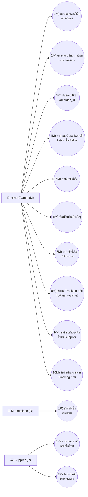
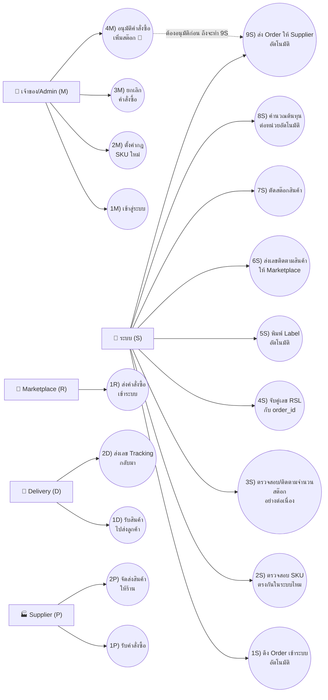
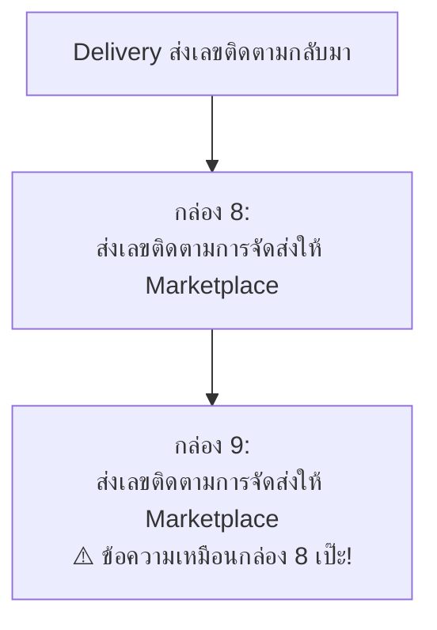
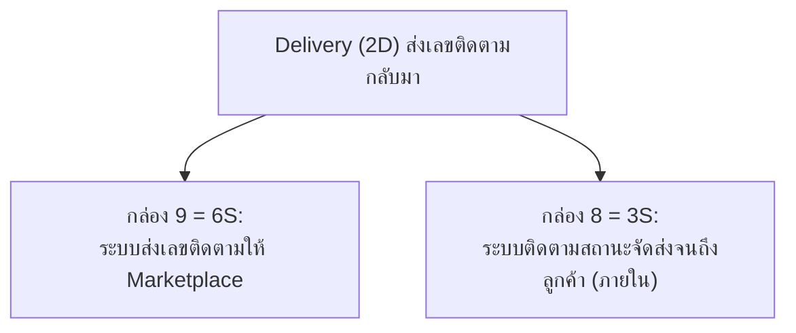

# วิธีทำ 3 งานนี้ (ฉบับอ่านง่าย)

> **อัปเดต:** ยึดตามสไตล์การวาด/เลขกำกับ UC ของ **sa-ref.pdf** (หัวข้อ 2.8 "ก่อนปรับปรุง" และ 2.11 "ที่ปรับปรุงแล้ว") เป็นต้นแบบ ไม่ได้ก็อป UC จาก CRUD Table sheet ตรงๆ อีกต่อไป (sheet นั้นเป็นแค่ตัวอย่าง/draft ยังไม่ใช่เวอร์ชันสุดท้าย)

อ่านไฟล์นี้ก่อน ถ้าอยากรู้รายละเอียด/เหตุผลลึกๆ ค่อยไปอ่าน [`01-use-case-diagram-fix-notes.md`](01-use-case-diagram-fix-notes.md) กับ [`02-biz-flow-fix-notes.md`](02-biz-flow-fix-notes.md)

## มี 3 งาน ทำตามลำดับนี้ ห้ามสลับ

| # | งาน | คืออะไร |
|---|---|---|
| 1 | ทำรูปใหม่ **`use-case-as-is.png`** (2.8) | ร่างแรก — เฉพาะ actor ที่มีอยู่จริงตอนทำงานมือ |
| 2 | แก้ `use-case.png` ให้เป็น **`use-case-to-be.png`** (2.11) | เวอร์ชันปรับปรุง — เพิ่ม actor/UC ที่ตกหล่นไป |
| 3 | แก้ `biz-flow-to-be.png` + `biz-flow-rel-use-case.png` | ให้ชื่อ UC ตรงกับเวอร์ชัน To-be จากงานที่ 2 |

## ระบบเลขกำกับ UC (ทำตามสไตล์ sa-ref)

sa-ref ใช้ตัวเลข+ตัวอักษรต่อท้ายชื่อ actor เช่น `1J)`, `2.1J)`, `1A)` — เราใช้แพทเทิร์นเดียวกัน แค่เปลี่ยนตัวอักษรให้ตรงกับ actor ของเรา:

| ตัวอักษร | Actor | หมายถึง |
|---|---|---|
| **M** | เจ้าของ/Admin | Merchant — คนกดเอง |
| **S** | ระบบ | System — ทำงานอัตโนมัติ |
| **D** | Delivery | บริษัทขนส่ง |
| **P** | Supplier | ซัพพลายเออร์ (Partner) |
| **R** | Marketplace | Rakuten |

รูปแบบชื่อ: `1M) ตรวจสอบคำสั่งซื้อด้วยตัวเอง` — ตัวเลขเรียงตามลำดับในแต่ละ actor ไม่ปนกัน

---

## รูป Use Case Diagram ต้องมีอะไรบ้าง (ใช้กับทั้ง 2 รูป)

**ต้องมี:**
- **Actor** = คนแท่ง (stick figure) 1 ตัวต่อ 1 บทบาท เขียนชื่อ + ตัวอักษรกำกับใต้รูป (เช่น "เจ้าของ/Admin (M)")
- **Use Case** = วงรี 1 วงต่อ 1 การกระทำ ชื่อขึ้นต้นด้วยเลขกำกับแบบ `1M)` ตามด้วย verb สั้นๆ
- **เส้นเชื่อม** actor → use case ที่เขาเกี่ยวข้อง เป็นเส้นตรงธรรมดา

**แนะนำ (ไม่บังคับ):** กรอบสี่เหลี่ยมล้อม use case ทั้งหมด เขียนชื่อระบบกำกับขอบบน

---

## งานที่ 1: `use-case-as-is.png` (2.8 — ร่างแรก)

**เฉพาะ actor ที่มีอยู่จริงตอนยังทำงานมือ** — ยังไม่มี "ระบบ" (ไม่มี automation) และยังไม่แยก "Delivery" ออกมา (เจ้าของยังเป็นคนติดต่อบริษัทขนส่งเอง)

**รวม 3 actor (M, R, P) — 13 UC**

### วิธีทำ

1. ไล่ดู `biz-flow-as-is.png` (flowchart งานมือ) ทีละกล่อง
2. แปลงแต่ละกล่องเป็น use case 1 อัน ใส่เลขกำกับตาม actor ที่ทำ (M/R/P ตามตารางข้างบน)
3. **ยังไม่ต้องมี actor "ระบบ" หรือ "Delivery"** — จุดประสงค์ของรูปนี้คือโชว์ว่า "ตอนยังไม่มี automation หน้าตาเป็นแบบนี้"

---

## งานที่ 2: แก้ `use-case.png` → `use-case-to-be.png` (2.11 — ปรับปรุงแล้ว)

**สิ่งที่เพิ่มจากงานที่ 1:**
1. **actor ใหม่ "ระบบ (S)"** — งานที่เคย M ทำเองด้วยมือ ย้ายมาให้ระบบทำอัตโนมัติ (นี่คือใจความหลักของโปรเจกต์)
2. **actor ใหม่ "Delivery (D)"** — แยกออกจาก M เพราะตอนนี้ระบบเชื่อมต่อกับบริษัทขนส่งโดยตรงแล้ว ไม่ใช่เจ้าของโทรศัพท์ติดต่อเอง
3. **UC ใหม่ "1M) เข้าสู่ระบบ"** — ตกหล่นไปตอนร่างแรก (แพทเทิร์นเดียวกับที่ sa-ref เพิ่ม "0A) เข้าสู่ระบบด้วย SSO" ตอนทำ 2.11)

**รวม 5 actor (M, S, R, D, P) — 18 UC**

**🔑 จุดสำคัญที่สุด (human-in-the-loop):** `4M) อนุมัติคำสั่งซื้อเพิ่มสต๊อก` ต้องเป็นของ **เจ้าของ/Admin** เท่านั้น — `9S` (ส่ง Order ให้ Supplier อัตโนมัติ) ทำได้ก็ต่อเมื่อ 4M อนุมัติแล้ว ห้ามให้ระบบข้ามขั้นนี้ไปเอง เพราะเป็นเรื่องเงิน (อาจารย์คอมเม้นไว้)

**หมายเหตุ UC ที่เพิ่มมาแก้ปัญหาที่เคยพลาดไปก่อนหน้านี้:**
- `6S) ส่งเลขติดตามสินค้าให้ Marketplace` — แยกออกจาก `9S` ชัดเจน (ก่อนหน้านี้สับสนกันอยู่ ทำให้ทั้งสอง UC มีความหมายเดียวกันโดยไม่ตั้งใจ) — **ส่งให้ Marketplace ไม่ใช่ลูกค้าโดยตรง** เพราะ biz-requirement.md ระบุว่าระบบเราไม่มีหน้าบ้านคุยกับลูกค้าเอง (ลูกค้าเห็นเลข tracking ผ่าน Rakuten เท่านั้น)
- `7S) ตัดสต๊อกสินค้า` — เคยขาดหายไปจากทุกเวอร์ชันก่อนหน้า ทั้งที่ biz-requirement.md ข้อ 8 (Action หลักในระบบ) ระบุไว้ชัดว่าต้องมี

### วิธีทำ

1. ลบ `use-case.png` เวอร์ชันเก่า (20 UC เดิม) ทิ้ง — ไม่ตรงกับโครงสร้างใหม่นี้แล้ว
2. วาดใหม่ตาม 5 actor + 18 UC ข้างบน
3. เน้น `4M` กับ `9S` ให้เห็นชัดว่าต้องผ่านการอนุมัติก่อน (ใส่กรอบ/สี/comment กำกับ)
4. เทียบกับงานที่ 1 (2.8) — ต้องเห็นชัดว่า **M เดิม 10 UC ลดเหลือ 4 UC** เพราะย้ายไป S และ D แทน

---

## งานที่ 3: แก้ `biz-flow-to-be.png` + `biz-flow-rel-use-case.png`

ทำหลังจากงานที่ 2 เสร็จแล้วเท่านั้น เพราะต้องใช้เลข UC เวอร์ชัน To-be ใหม่ (S1-S9, M1-M4, D1-D2, P1-P2, R1)

### ปัญหา A: กล่องในโฟลว์มีข้อความซ้ำกัน 2 กล่อง

**แก้เป็น:** ให้ตรงกับ `6S`/`2D` คนละกล่องคนละความหมาย

### ปัญหา B: ป้ายชื่อ UC ไม่ตรงกับสิ่งที่กล่องทำจริง

| ป้าย UC เขียนว่า | แต่กล่องข้างในทำเรื่อง | ต้องแก้ |
|---|---|---|
| "อัพเดท**สถานะการจัดส่ง**" | "Update **จำนวนสินค้า**ใน Marketplace" | เปลี่ยนป้ายให้ตรงกับ UC ที่ถูกต้องจริง (ไม่มี UC นี้ในชุดใหม่ ให้พิจารณาว่าเป็นส่วนหนึ่งของ `1S` หรือ `6S`) |

### ปัญหา C: ชื่อ "จับคู่ Order กับ RSL" ถูกใช้ซ้ำ 2 ที่

- กล่องที่ครอบ "Match เลข RSL กับ order_id" = **`4S`** ใช้ถูกที่แล้ว
- กล่องที่ครอบ "ดึง Order เข้าระบบ + เช็คกฎ SKU" ควรเป็น **`1S`/`2S`** (ดึง Order / เช็ค SKU) ไม่ใช่เรื่อง RSL

### ปัญหา D: พิมพ์ชื่อผิด

มุมบนซ้ายของ `biz-flow-to-be.png` เขียนว่า **"f"** ตัวเดียว → แก้เป็น **"Marketplace"**

---

## เช็คลิสต์สั้นๆ ก่อนบอกว่าทำเสร็จ

**งานที่ 1 — use-case-as-is.png**
- [ ] มี 3 actor: M (เจ้าของ), R (Marketplace), P (Supplier) — **ไม่มี** S หรือ D
- [ ] มี UC ครบ 13 อัน เลขกำกับถูกต้องตาม actor (1M-10M, 1R, 1P-2P)

**งานที่ 2 — use-case-to-be.png**
- [ ] มี 5 actor: M, S, D, R, P (เพิ่ม S กับ D จากงานที่ 1)
- [ ] มี UC ครบ 18 อัน (1M-4M, 1S-9S, 1R, 1D-2D, 1P-2P)
- [ ] `4M` (อนุมัติสั่งซื้อ) เป็นของเจ้าของ/Admin ไม่ใช่ระบบ
- [ ] `9S` (ส่ง Order ให้ Supplier) ต้องเกิดหลัง `4M` อนุมัติแล้วเท่านั้น (มี note/เส้นกำกับ)
- [ ] มี `6S` (ส่งเลขติดตามให้ **Marketplace** ไม่ใช่ลูกค้าโดยตรง) และ `7S` (ตัดสต๊อก) แล้ว — 2 อันนี้เคยตกหล่น/พิมพ์ผิดในเวอร์ชันก่อนๆ
- [ ] ลบ use-case.png เวอร์ชัน 20 UC เดิมทิ้งแล้ว

**งานที่ 3 — biz-flow**
- [ ] กล่อง 8-9 ไม่ซ้ำข้อความกันแล้ว ตรงกับ `6S` (ส่งเลขติดตามให้ Marketplace) / `3S` (ติดตามสถานะ)
- [ ] ชื่อ/เลข UC ทุกอันในไดอะแกรมตรงกับชุด M/S/D/R/P ใหม่
- [ ] แก้ "f" เป็น "Marketplace" แล้ว
