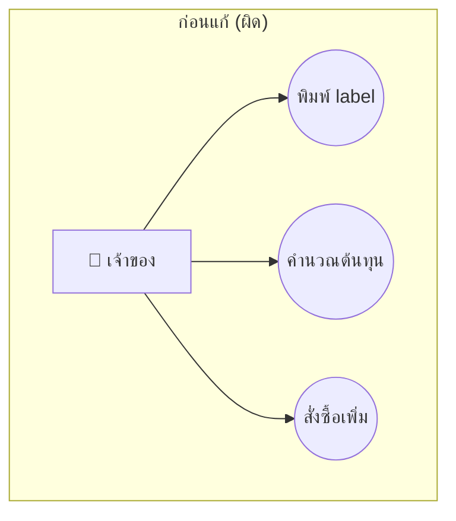
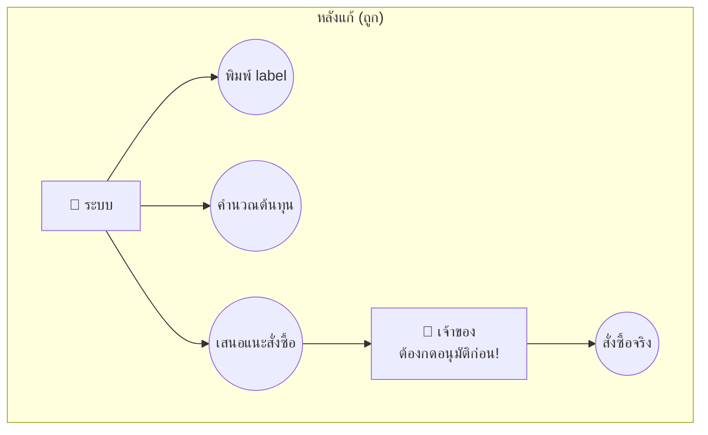
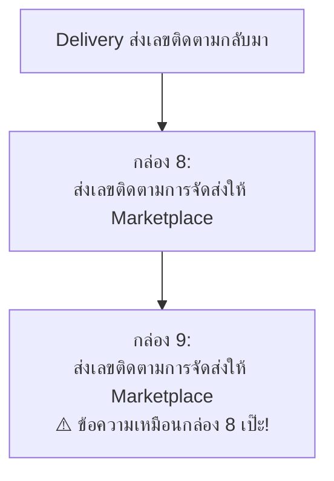
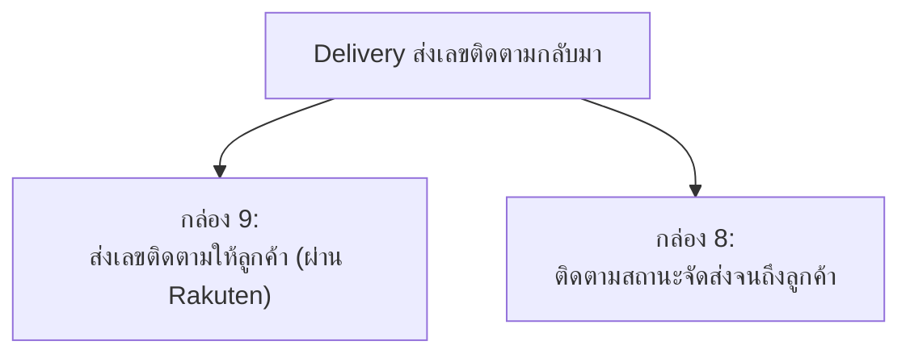

# วิธีแก้ 2 ไฟล์นี้ (ฉบับอ่านง่าย 5 นาที)

อ่านไฟล์นี้ก่อน ถ้าอยากรู้รายละเอียด/เหตุผลลึกๆ ค่อยไปอ่าน [`01-use-case-diagram-fix-notes.md`](01-use-case-diagram-fix-notes.md) กับ [`02-biz-flow-fix-notes.md`](02-biz-flow-fix-notes.md)

## ก่อนอื่น ทำไมต้องแก้ 2 ไฟล์นี้พร้อมกัน

- **`use-case.png`** = รูปวงรีๆ บอกว่า **"ใครทำอะไรได้บ้าง"** ในระบบ
- **`biz-flow-to-be.png` / `biz-flow-rel-use-case.png`** = รูป flowchart บอก **"ขั้นตอนการทำงานจริงเป็นยังไง"**

ทั้งสองไฟล์พูดเรื่องเดียวกัน แค่คนละมุม ⇒ **ชื่อ use case ต้องตรงกับชื่อ process ในโฟลว์เป๊ะๆ** ถ้าไม่ตรง = ผิด

**ลำดับแก้: ต้องแก้ `use-case.png` ให้เสร็จก่อน แล้วค่อยไปแก้ biz-flow ตาม** (เพราะ biz-flow อ้างอิงชื่อจาก use-case.png)

---

## แก้ที่ 1: `use-case.png`

### ปัญหาหลัก: งานที่ควร "อัตโนมัติ" ถูกวาดว่าเจ้าของทำเอง

ปัญหา: ทั้ง 3 อันนี้ควรเป็นงานที่ **ระบบทำเองอัตโนมัติ** (ตามที่ตั้งใจไว้ตั้งแต่แรก) แต่ในรูปกลับวาดให้เจ้าของเป็นคนกดเองหมด

**⚠️ จุดสำคัญที่สุด:** "สั่งซื้อเพิ่ม" **ห้าม** ทำอัตโนมัติ 100% เพราะเป็นเรื่องเงิน — อาจารย์คอมเม้นแล้วว่าต้องมีเจ้าของอนุมัติก่อนเสมอ (human-in-the-loop) ส่วน "พิมพ์ label" กับ "คำนวณต้นทุน" อัตโนมัติเต็มที่ได้เลย เพราะไม่เสียเงิน แก้ไขทีหลังได้

### สิ่งที่ต้องทำ (เรียงตามนี้)

1. เพิ่ม actor ใหม่ชื่อ **"ระบบ"** (วาดเป็นคนแท่งเหมือน actor อื่นก็ได้)
2. ย้าย 4 อัน นี้จาก "เจ้าของ" ไปเป็น "ระบบ": **พิมพ์ label, คำนวณต้นทุน, เช็คสต๊อก, เสนอแนะสั่งซื้อ**
3. **"ตัดสินใจสั่งซื้อ" (อนุมัติ) ให้อยู่กับ "เจ้าของ" เหมือนเดิม** — ห้ามย้าย นี่คือจุด human-in-the-loop
4. เพิ่ม use case ที่หายไป 2 อัน: **"รับออเดอร์ใหม่จาก Rakuten"** และ **"ตัดสต๊อกสินค้า"** (ใส่ไว้กับ actor "ระบบ")
5. เช็คชื่อซ้ำ: "อัพเดทสถานะการจัดส่ง" มีอยู่ 2 ที่ (ที่เจ้าของ กับที่ Marketplace) ต้องตั้งชื่อให้ไม่ซ้ำกัน เช่น ฝั่งเราเปลี่ยนเป็น "ส่งอัพเดทสถานะไปที่ Rakuten"
6. ชื่อยาวไป: "ตัดสินใจการสั่งซื้อสินค้ามาเติม Stock จากการคำนวณ Cost ที่ระบบคำนวณให้" → ย่อเหลือ **"อนุมัติคำสั่งซื้อเติมสต๊อก"**

---

## แก้ที่ 2: `biz-flow-to-be.png` + `biz-flow-rel-use-case.png`

ทำหลังจากแก้ use-case.png เสร็จแล้วเท่านั้น เพราะต้องใช้ชื่อ UC เวอร์ชันใหม่

### ปัญหา A: กล่องในโฟลว์มีข้อความซ้ำกัน 2 กล่อง

**แก้เป็น:** ให้ 2 กล่องนี้เขียนคนละเรื่องกัน เช่น

### ปัญหา B: ป้ายชื่อ UC ไม่ตรงกับสิ่งที่กล่องทำจริง

| ป้าย UC เขียนว่า | แต่กล่องข้างในทำเรื่อง | ต้องแก้ |
|---|---|---|
| "อัพเดท**สถานะการจัดส่ง**" | "Update **จำนวนสินค้า**ใน Marketplace" | เลือกให้ตรงกันอันใดอันหนึ่ง (แก้ชื่อ UC หรือแก้เนื้อกล่อง) |

### ปัญหา C: ชื่อ "จับคู่ Order กับ RSL" ถูกใช้ซ้ำ 2 ที่ (เลข UC 4 และ UC 12)

- UC4 = ใช้ถูกที่แล้ว (ครอบกล่อง "Match เลข RSL กับ order_id")
- UC12 = ใช้ผิด ควรเป็นชื่อ **"จับคู่ SKU"** แทน (เพราะกล่องที่มันครอบจริงๆ เกี่ยวกับ SKU ไม่ใช่ RSL)

### ปัญหา D: พิมพ์ชื่อผิด

มุมบนซ้ายของ `biz-flow-to-be.png` เขียนว่า **"f"** ตัวเดียว → แก้เป็น **"Marketplace"**

---

## เช็คลิสต์สั้นๆ ก่อนบอกว่าแก้เสร็จ

- [ ] use-case.png: "ระบบ" เป็นคนทำ พิมพ์ label / คำนวณต้นทุน / เช็คสต๊อก / เสนอแนะสั่งซื้อ
- [ ] use-case.png: "เจ้าของ" ยังคงเป็นคนอนุมัติสั่งซื้อจริง (ห้ามเอาออก)
- [ ] use-case.png: เพิ่ม UC "รับออเดอร์ใหม่" กับ "ตัดสต๊อก" แล้ว
- [ ] biz-flow: กล่อง 8-9 ไม่ซ้ำข้อความกันแล้ว
- [ ] biz-flow: ชื่อ UC ทุกอันตรงกับกล่องที่มันครอบ
- [ ] biz-flow: แก้ "f" เป็น "Marketplace" แล้ว
- [ ] biz-flow: "จับคู่ Order กับ RSL" เหลือแค่ 1 เลข (UC4) ส่วน UC12 เปลี่ยนเป็น "จับคู่ SKU"
