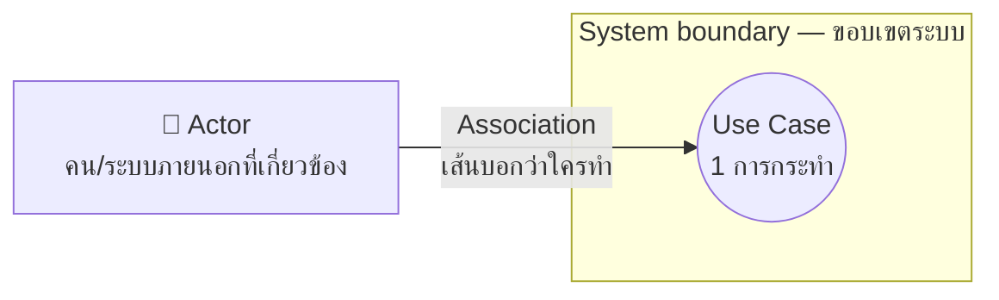
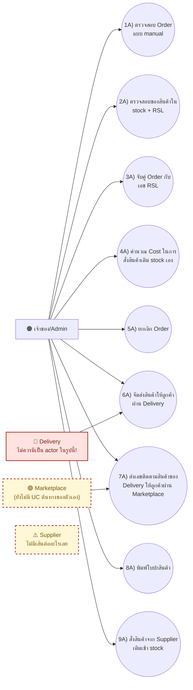
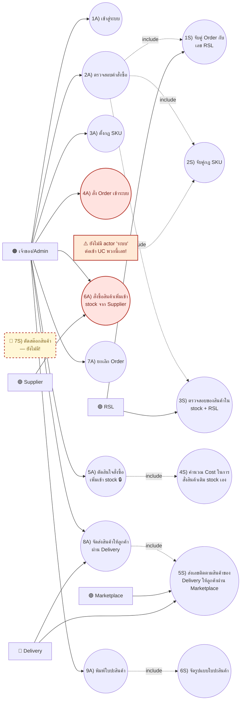
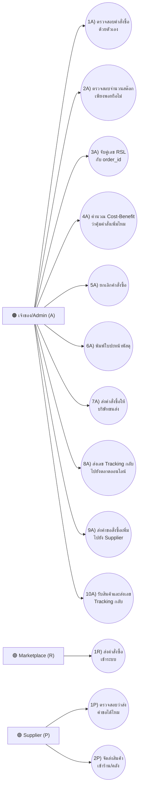
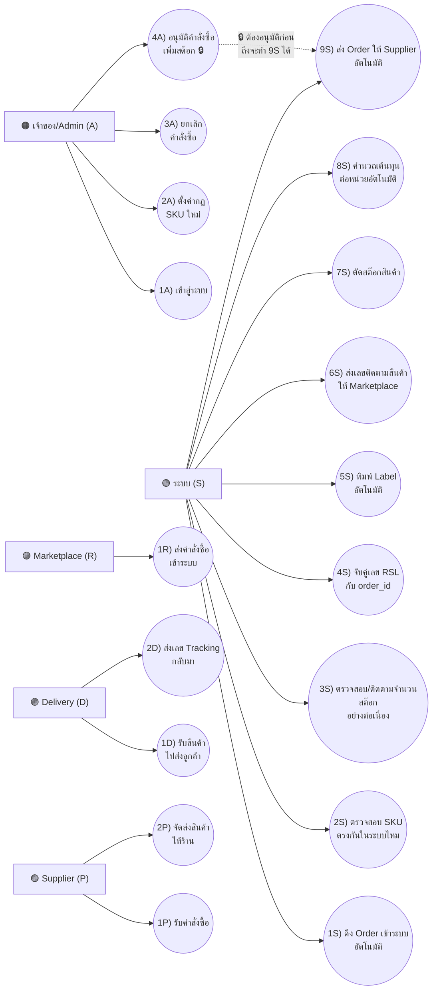

# Use Case Diagram คู่มือฉบับรูปภาพ (สำหรับคนไม่ถนัดอ่านเช็คลิสต์ยาวๆ)

> ไฟล์นี้เป็นเวอร์ชันภาพประกอบของ [`00-how-to-fix-simple.md`](00-how-to-fix-simple.md) — เปิดไฟล์นี้ด้วย VS Code (กด `Cmd+Shift+V` เพื่อ preview) หรือดูบน GitHub จะเห็นไดอะแกรมเรนเดอร์เป็นรูปอัตโนมัติ ไม่ต้องเปิดเว็บไหนเพิ่ม
>
> เวอร์ชันเว็บที่มีสีสัน/คำอธิบายละเอียดกว่านี้: https://claude.ai/code/artifact/4edf6f30-c122-42e3-917f-864898a9467d (ไม่บังคับต้องเปิด อ่านไฟล์นี้พอ)
>
> **อัปเดต:** หัวข้อ 3-4 อัปเดตให้ตรงกับดราฟต์ล่าสุดที่เพื่อนส่งมา (As-Is v1.0 / To-Be v1.2) พร้อมมาร์คจุดที่ยังต้องแก้ไว้ในรูปเดียวกันเลย (สีแดง/เส้นประ) ส่วนหัวข้อ 5 คือรูปเป้าหมายสุดท้ายไว้เทียบ

---

## 1. Use Case คืออะไร (30 วินาที)

**Use Case = 1 วงรี = 1 สิ่งที่ใครคนหนึ่ง (หรือระบบ) ทำแล้วได้ผลลัพธ์ที่มีประโยชน์**

ไดอะแกรมมีแค่ 4 อย่างเท่านั้น:

**กฎ 2 ข้อที่ห้ามลืม:**
1. เส้นต้องไปจบที่ **วงรี** เท่านั้น ห้ามลาก actor ไปหา actor ตรงๆ
2. **Actor ทุกตัว**ที่วาดในรูป ต้องมีเส้นต่อกับ use case อย่างน้อย 1 เส้น — วาด actor ลอยไว้เฉยๆ ไม่ได้

---

## 2. 5 Actor ของระบบ Colorado (ใช้ตัวอักษรกำกับ)

| ตัวอักษร | Actor | ความหมาย |
|---|---|---|
| **A** 🟠 | เจ้าของ/Admin | คนกดเอง ตัดสินใจเอง (manual) |
| **S** 🟢 | ระบบ | โปรแกรมทำงานเอง ไม่มีคนกด (automated) — ใจความหลักของโปรเจกต์ |
| **R** 🟣 | Marketplace (Rakuten) | ต้นทางของทุก order |
| **D** 🟣 | Delivery | บริษัทขนส่ง (มีเฉพาะเวอร์ชัน To-Be) |
| **P** 🟣 | Supplier | ปลายทางตอนสั่งของเติม stock |
| **RSL** 🟣 | RSL (fulfillment) | แหล่งข้อมูลสต๊อกหลัก/ผู้ให้บริการ fulfillment — เพิ่มเป็น actor แยกแล้วในดราฟต์ล่าสุด ✅ |

สีที่ใช้ในคำอธิบายด้านล่าง: 🟠 = manual, 🟢 = automated, 🟣 = external

---

## 3. As-Is v1.0 (ล่าสุดที่ส่งมา) — จุดที่ต้องแก้

สีแดง/เส้นประ = จุดที่ยังผิดอยู่ ต้องแก้ก่อนถือว่าเสร็จ:

**ต้องแก้:**
1. 🚫 **เอา actor "Delivery" ออก** — กฎของรูป As-Is คือห้ามมี "ระบบ" หรือ "Delivery" เพราะยังไม่มี automation ตอนนั้นเจ้าของยังติดต่อขนส่งเอง งานที่ `6A`/`7A` ทำอยู่แล้วสื่อความหมายนี้พอแล้ว ไม่ต้องวาด Delivery แยก
2. ⚠️ **Supplier ไม่มีเส้นต่อเลย** (actor ลอย) — ต้องลากเส้นเข้า `9A) สั่งสินค้าจาก Supplier เติมเข้า stock`
3. ⚠️ **Marketplace ยังไม่มี UC ต้นทางของตัวเอง** — ตอนนี้ต่อแค่เข้า `7A` (รับข้อมูลอย่างเดียว) ทั้งที่ในความจริง Marketplace เป็นคนเริ่มส่ง order เข้ามาก่อน ควรมี UC แยก เช่น "ส่งคำสั่งซื้อเข้าระบบ"

---

## 4. To-Be v1.2 (ล่าสุดที่ส่งมา) — จุดที่ต้องแก้

*(ลูกศร `<<include>>` วาดคร่าวๆ ตามที่เพื่อนส่งมา อาจไม่ตรงทุกเส้นเป๊ะ ใช้ดูเพื่อชี้จุดที่ต้องแก้เป็นหลัก)*

**ต้องแก้ (เรียงตามความสำคัญ):**
1. ⚠️ **ยังไม่มี actor "ระบบ" ต่อเข้า 1S-6S เลย** — UC ฝั่งนี้ทั้งหมดยังเป็นแค่ `<<include>>` ที่ต่อพ่วงออกมาจาก UC ของ Admin เท่านั้น ไม่มีเส้นจาก actor ไหนเข้าไปหาโดยตรง ต้องเพิ่มคนแท่ง "ระบบ (S)" แล้วลากเส้นต่อเข้า UC เหล่านี้ด้วย ไม่งั้นรูปนี้จะไม่ได้สื่อว่ามี automation จริงๆ เลย
2. 🚫 **`4A) สั่ง Order เข้าระบบ` กับ `6A) สั่งซื้อสินค้าเพิ่มเข้า stock จาก Supplier` ไม่ควรเป็นของ Admin** — biz-requirement บอกชัดว่า 2 งานนี้ต้อง**อัตโนมัติ**: ดึง order เข้าระบบเองอัตโนมัติ (ไม่ใช่ Admin กดรับเอง) และหลัง Admin อนุมัติ (`5A`) แล้ว **ระบบ**ต้องเป็นคนส่งคำสั่งซื้อให้ Supplier เอง — ย้าย 2 อันนี้ไปเป็นของ actor "ระบบ" แทน แล้วลากเส้นประจาก `5A` ไปยัง UC ใหม่ (เช่น "ส่ง Order ให้ Supplier อัตโนมัติ") กำกับว่าต้องอนุมัติก่อนเท่านั้นถึงทำได้ — นี่คือจุด human-in-the-loop ที่อาจารย์เน้น ถ้าให้ Admin ทำเองทั้งสองขั้นจะเสียจุดขายเรื่อง automation ไปเลย
3. 🚫 **`7S) ตัดสต๊อกสินค้า` ยังหายไป** — ตกหล่นมาทุกเวอร์ชันก่อนหน้านี้แล้ว เพราะ biz-requirement ข้อ 8 ระบุไว้ชัดว่าเป็น action หลัก

**ทำถูกแล้ว ไม่ต้องแก้:**
- ✅ เพิ่ม actor **RSL** มาแล้ว (แก้ปัญหาเก่าที่เคยขาด)
- ✅ Supplier ไม่ได้ลากเส้นตรงเข้า actor อื่นแล้ว เชื่อมกับ UC (`6A`) แทน — ไม่มี actor ลอยแล้ว
- ✅ `5A` (อนุมัติสั่งซื้อ) ยังเป็นของ Admin ไม่ใช่ระบบ — ถูกต้องตามคอมเมนต์อาจารย์

---

## 5. เป้าหมายสุดท้าย (ถ้าแก้ครบทั้งสองรูปแล้วจะหน้าตาแบบนี้)

**As-Is เป้าหมาย: 3 actor (A, R, P) — 13 UC**

**To-Be เป้าหมาย: 5 actor (A, S, R, D, P) — 18 UC** — เวอร์ชันนี้ไม่มี RSL/`<<include>>` เพราะเป็นแนวทางเดิมของ `00-how-to-fix-simple.md` ถ้าจะเก็บ RSL ไว้ (แนะนำให้เก็บ เพราะแก้ปัญหา actor ที่เคยขาด) ให้เพิ่ม RSL เป็น actor ที่ 6 ต่อเข้า UC ที่เกี่ยวกับสต๊อก/RSL ได้เลย ไม่ขัดกับโครงนี้

---

## 6. เช็คลิสต์สรุป

- [ ] เอา actor "Delivery" ออกจากรูป As-Is
- [ ] Supplier ในรูป As-Is ต้องมีเส้นต่อเข้า UC
- [ ] Marketplace ในรูป As-Is ต้องมี UC ต้นทางของตัวเอง
- [ ] เพิ่ม actor "ระบบ" ต่อเส้นเข้า 1S-6S โดยตรงในรูป To-Be
- [ ] ย้าย `4A`/`6A` (รับ order เข้าระบบ / ส่งสั่งซื้อให้ Supplier) ไปเป็นของ actor "ระบบ" แทน Admin
- [ ] เพิ่ม `7S) ตัดสต๊อกสินค้า` ในรูป To-Be
- [x] เพิ่ม actor RSL แล้ว
- [x] Supplier ในรูป To-Be ไม่ dangling แล้ว
- [x] จุดอนุมัติสั่งซื้อยังอยู่กับ Admin ถูกต้อง

หลังแก้ครบแล้ว export เป็น `.png` ตั้งชื่อ `use-case-as-is.png` และ `use-case-to-be.png` ตามที่ [`00-how-to-fix-simple.md`](00-how-to-fix-simple.md) อ้างถึง
