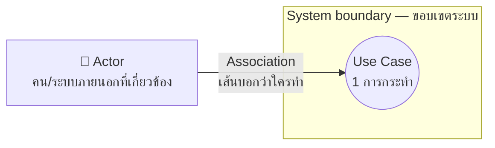
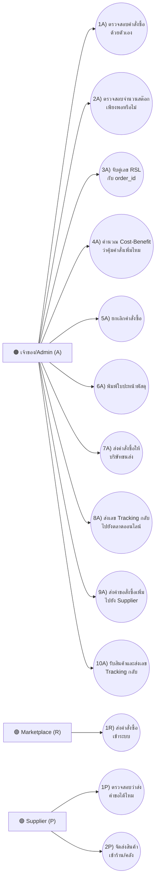
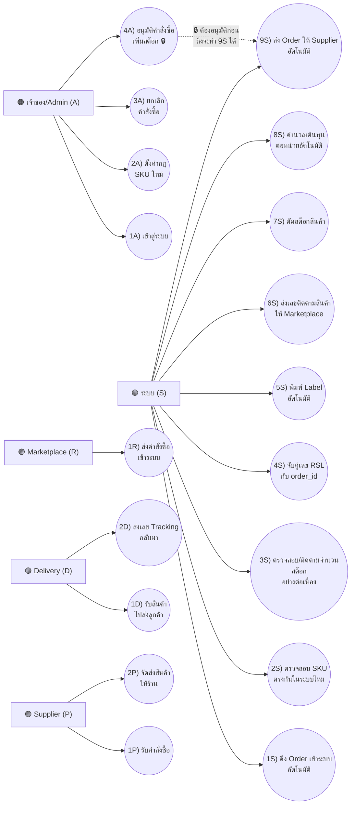

# Use Case Diagram คู่มือฉบับรูปภาพ (สำหรับคนไม่ถนัดอ่านเช็คลิสต์ยาวๆ)

> ไฟล์นี้เป็นเวอร์ชันภาพประกอบของ [`00-how-to-fix-simple.md`](00-how-to-fix-simple.md) — เปิดไฟล์นี้ด้วย VS Code (กด `Cmd+Shift+V` เพื่อ preview) หรือดูบน GitHub จะเห็นไดอะแกรมเรนเดอร์เป็นรูปอัตโนมัติ ไม่ต้องเปิดเว็บไหนเพิ่ม
>
> เวอร์ชันเว็บที่มีสีสัน/คำอธิบายละเอียดกว่านี้: https://claude.ai/code/artifact/4edf6f30-c122-42e3-917f-864898a9467d (ไม่บังคับต้องเปิด อ่านไฟล์นี้พอ)

---

## 1. Use Case คืออะไร (30 วินาที)

**Use Case = 1 วงรี = 1 สิ่งที่ใครคนหนึ่ง (หรือระบบ) ทำแล้วได้ผลลัพธ์ที่มีประโยชน์**

ไดอะแกรมมีแค่ 4 อย่างเท่านั้น:

**กฎ 2 ข้อที่ห้ามลืม:**
1. เส้นต้องไปจบที่ **วงรี** เท่านั้น ห้ามลาก actor ไปหา actor ตรงๆ
2. **Actor ทุกตัว**ที่วาดในรูป ต้องมีเส้นต่อกับ use case อย่างน้อย 1 เส้น — วาด actor ลอยไว้เฉยๆ ไม่ได้

---

## 2. 5 Actor ของระบบ Colorado (ใช้ตัวอักษรกำกับ)

| ตัวอักษร | Actor | ความหมาย |
|---|---|---|
| **A** 🟠 | เจ้าของ/Admin | คนกดเอง ตัดสินใจเอง (manual) |
| **S** 🟢 | ระบบ | โปรแกรมทำงานเอง ไม่มีคนกด (automated) — ใจความหลักของโปรเจกต์ |
| **R** 🟣 | Marketplace (Rakuten) | ต้นทางของทุก order |
| **D** 🟣 | Delivery | บริษัทขนส่ง (มีเฉพาะเวอร์ชัน To-Be) |
| **P** 🟣 | Supplier | ปลายทางตอนสั่งของเติม stock |

สีที่ใช้ในคำอธิบายด้านล่าง: 🟠 = manual, 🟢 = automated, 🟣 = external

---

## 3. As-Is — ตอนยังทำงานด้วยมือทั้งหมด (2.8)

**กฎของรูปนี้: ห้ามมี actor "ระบบ" หรือ "Delivery"** เพราะกำลังโชว์ "ก่อนเริ่มโปรเจกต์" เจ้าของยังติดต่อขนส่งเอง

**รวม 3 actor (A, R, P) — 13 UC** — ถ้านับได้ไม่ตรง แปลว่ามี UC หายหรือเกิน

---

## 4. To-Be — หลังเอา automation เข้ามาแทนที่ (2.11)

จุดสำคัญที่สุด: งานสีส้ม (เจ้าของทำเอง) ย้ายไปเป็นสีเขียว (ระบบทำอัตโนมัติ) เกือบหมด **ยกเว้นจุดเดียว** — การอนุมัติสั่งซื้อ เพราะเป็นเรื่องเงินจริง อาจารย์ไม่ให้ระบบตัดสินใจเอง

**รวม 5 actor (A, S, R, D, P) — 18 UC**

---

## 5. เช็คลิสต์ก่อนบอกว่าวาดเสร็จ

เทียบกับดราฟต์ที่เคยส่งมา (ไฟล์ `.drawio`) จุดที่ต้องแก้มี 5 ข้อนี้:

- [ ] **actor "ระบบ (S)" ต้องมีเส้นต่อเข้า 1S-9S โดยตรง** — ห้ามให้ UC ของระบบต่อพ่วงออกมาจาก UC ของ Admin เท่านั้น (เช่น `2A` include `1S`) เพราะจะสื่อผิดว่าระบบทำงานได้ก็ต่อเมื่อ Admin กดก่อน ทั้งที่ควรเป็น background job อิสระ
- [ ] **ต้องมี `7S) ตัดสต๊อกสินค้า`** — ตกหล่นมาทุกเวอร์ชันก่อนหน้านี้แล้ว เพราะ biz-requirement ข้อ 8 ระบุไว้ชัดว่าเป็น action หลัก
- [ ] **ต้องมี `9S) ส่ง Order ให้ Supplier อัตโนมัติ`** พร้อมเส้นประ + note กำกับว่าทำได้ก็ต่อเมื่อ `4A` อนุมัติแล้วเท่านั้น (ดูลูกศรประในรูปข้อ 4)
- [ ] **ห้ามลากเส้น actor → actor ตรงๆ** (เช่น Supplier ต่อเข้า "เจ้าของ" ตรงๆ) — actor ต้องต่อกับ use case เท่านั้น ถ้า Supplier เกี่ยวข้อง ต้องมี UC ของตัวเอง เช่น `1P) รับคำสั่งซื้อ`
- [ ] **Marketplace และ Delivery ต้องมี UC ต้นทางของตัวเอง** ไม่ใช่แค่ "ปลายทาง" ที่รับข้อมูลจาก use case ของ actor อื่นอย่างเดียว — Marketplace ต้องมี `1R) ส่งคำสั่งซื้อเข้าระบบ`, Delivery ต้องมี `2D) ส่งเลข Tracking กลับมา`

ข้อที่ทำถูกอยู่แล้ว ไม่ต้องแก้: `4A) อนุมัติคำสั่งซื้อ` ยังอยู่กับ Admin ไม่ใช่ระบบ — เก็บไว้แบบนี้

หลังแก้ครบแล้ว export เป็น `.png` ตั้งชื่อ `use-case-as-is.png` และ `use-case-to-be.png` ตามที่ [`00-how-to-fix-simple.md`](00-how-to-fix-simple.md) อ้างถึง
