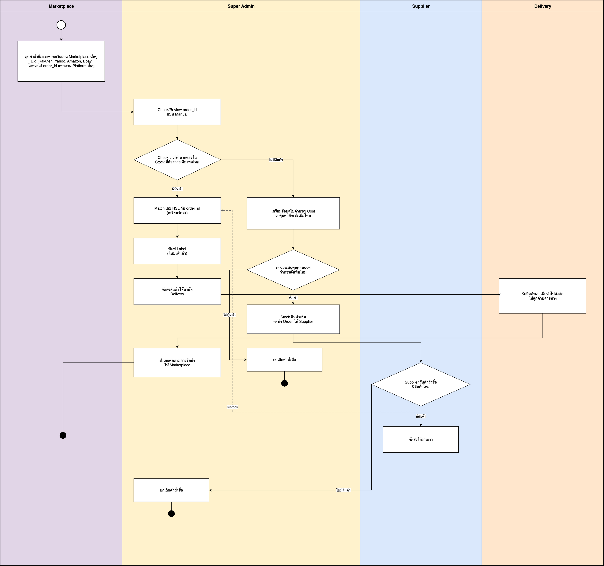
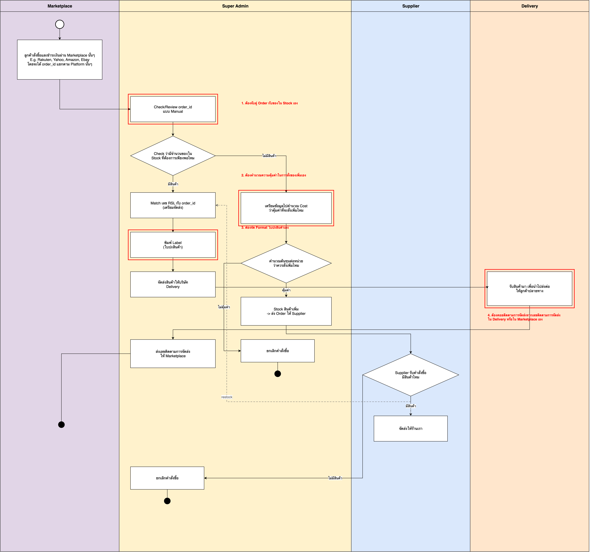
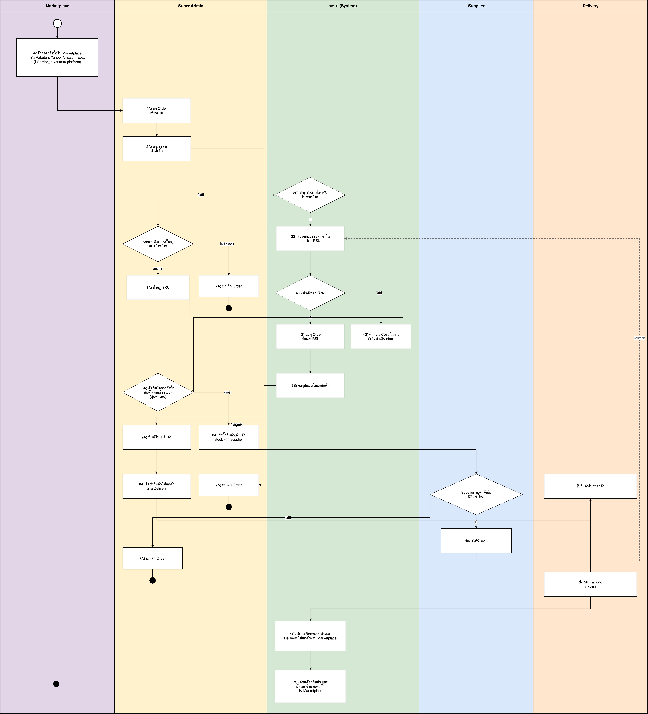
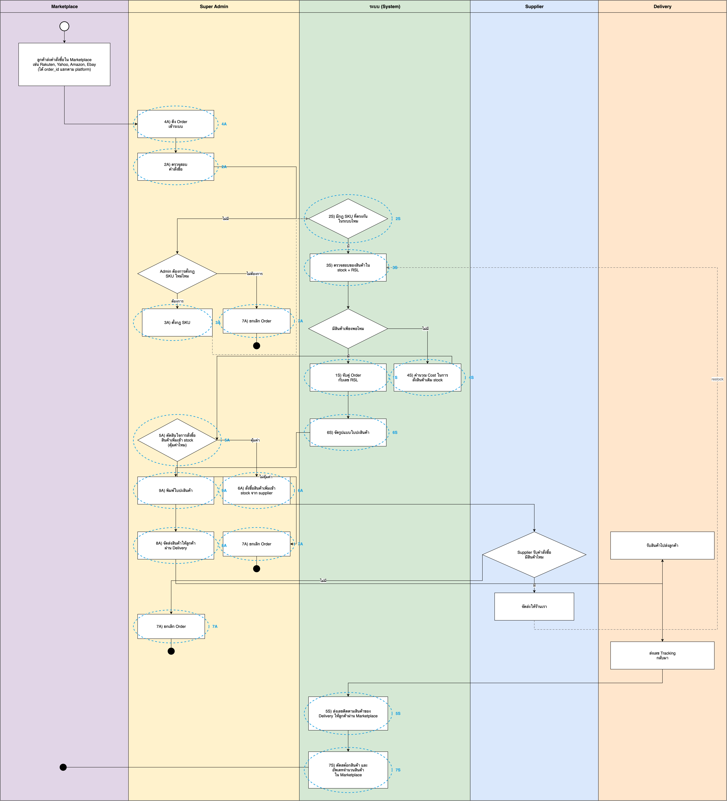
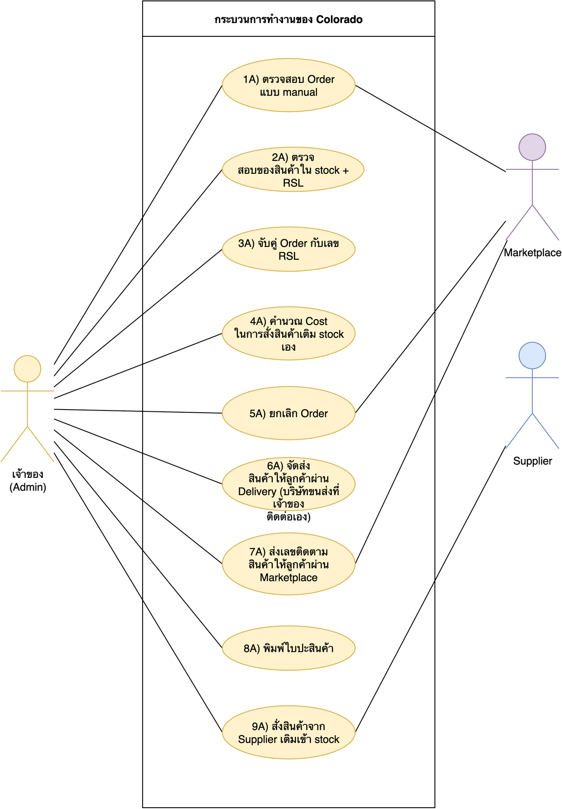
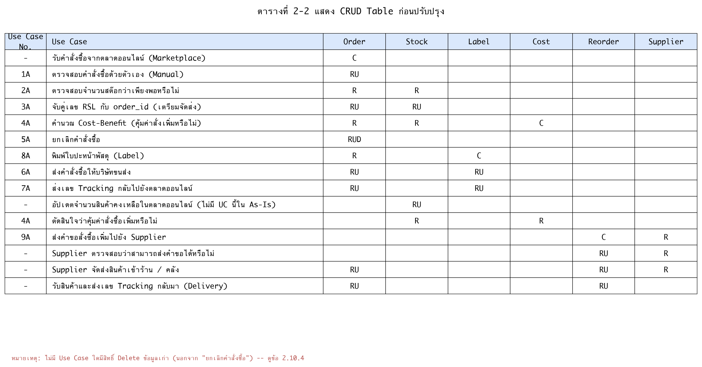
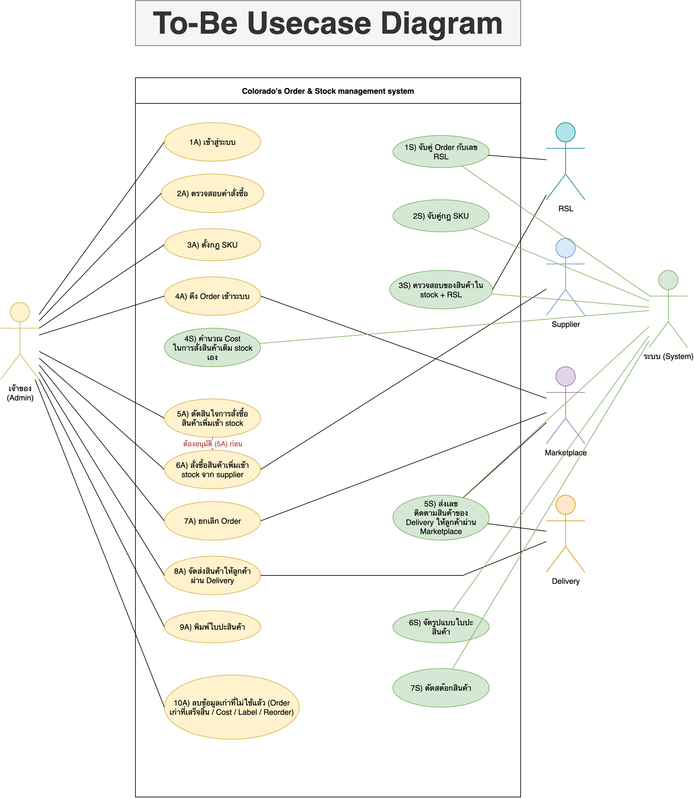
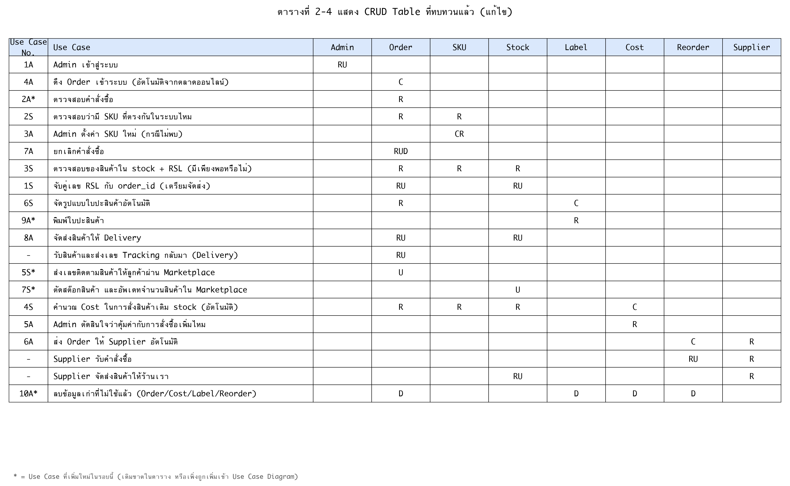

# บทที่ 2 (ตอนที่ 1) — เนื้อหาฉบับร่างสำหรับหัวข้อ 2.1–2.12

ไฟล์นี้เขียนเนื้อหาข้อความ/ตารางที่ sa-ref.pdf มีแต่ของโปรเจกต์ Colorado ยังไม่ได้เขียน (2.2, 2.3, 2.5, 2.7, 2.10) พร้อมทั้งตาราง CRUD ที่แก้ไขแล้ว (2.12) — คัดลอกไปวางในเล่มรายงานได้เลย ปรับสำนวนตามสไตล์การเขียนของกลุ่มได้ตามสะดวก

รูปทั้งหมดอยู่ที่ `img/final/` ชื่อไฟล์ตรงกับเลขหัวข้อ

---

## 2.1 Business Process เดิม (As-Is)

รูปที่ 2-1 แสดงข้อมูล Business Process เดิม

---

## 2.2 คำอธิบาย Business Process เดิม

2.2.1 ลูกค้าสั่งซื้อและชำระเงินผ่าน Marketplace ที่ต้องการ เช่น Rakuten, Yahoo, Amazon, Ebay โดยแต่ละ Platform จะสร้าง order_id แยกตาม Platform นั้นๆ

2.2.2 Super Admin ตรวจสอบและทาน order_id ที่เข้ามาด้วยตนเองแบบ Manual

2.2.3 Super Admin เช็คว่ามีจำนวนสินค้าที่ลูกค้าต้องการเพียงพอใน Stock หรือไม่

2.2.4 หากมีสินค้าเพียงพอ Super Admin จะจับคู่เลข RSL กับ order_id ด้วยตนเองเพื่อเตรียมจัดส่ง

2.2.5 Super Admin พิมพ์ Label (ใบปะสินค้า) ด้วยตนเอง

2.2.6 Super Admin จัดส่งสินค้าให้บริษัท Delivery ที่ติดต่อไว้เอง

2.2.7 Delivery รับสินค้าไปเพื่อนำไปส่งต่อให้ลูกค้าปลายทาง

2.2.8 Super Admin ส่งเลขติดตามการจัดส่งกลับไปให้ลูกค้าผ่าน Marketplace ด้วยตนเอง เพื่อจบกระบวนการ

2.2.9 หากสินค้าใน Stock ไม่เพียงพอ Super Admin จะเตรียมข้อมูลเพื่อคำนวณต้นทุน (Cost) ว่าคุ้มค่าที่จะสั่งสินค้าเพิ่มหรือไม่

2.2.10 Super Admin คำนวณต้นทุนต่อหน่วยด้วยตนเอง เพื่อตัดสินใจว่าควรสั่งสินค้าเพิ่มหรือไม่

2.2.11 หากคุ้มค่า Super Admin จะสั่งซื้อสินค้าเพิ่มเข้า Stock จาก Supplier มิฉะนั้นจะยกเลิกคำสั่งซื้อ

2.2.12 Supplier ตรวจสอบว่ามีสินค้าตามที่สั่งหรือไม่ หากมีจะจัดส่งสินค้าเข้าร้าน ทำให้กระบวนการวนกลับไปจับคู่เลข RSL อีกครั้ง (restock) หากไม่มีสินค้า Super Admin จะยกเลิกคำสั่งซื้อ

---

## 2.3 ปัญหาของ Business Process เดิม

รูปที่ 2-1.1 แสดงจุดที่เป็นปัญหาใน Business Process เดิม

จากการวิเคราะห์ Business Process เดิม พบปัญหาดังนี้

2.3.1 **ต้องจับคู่ Order กับสินค้าใน Stock ด้วยตนเอง** — Super Admin ต้องตรวจสอบและจับคู่ order_id กับจำนวนสินค้าคงเหลือใน Stock ทุกครั้งด้วยตนเอง ทำให้ใช้เวลานานและมีโอกาสจับคู่ผิดพลาดเมื่อมี Order เข้ามาพร้อมกันจำนวนมาก

2.3.2 **ต้องคำนวณความคุ้มค่าในการสั่งของเพิ่มด้วยตนเอง** — เมื่อสินค้าใน Stock ไม่พอ Super Admin ต้องคำนวณต้นทุนต่อหน่วยเองเพื่อตัดสินใจว่าควรสั่งเพิ่มหรือไม่ ทำให้การตัดสินใจล่าช้าและขึ้นอยู่กับดุลยพินิจส่วนบุคคล ไม่มีมาตรฐานที่แน่นอน

2.3.3 **ต้องจัด Format ใบปะสินค้าเอง** — Super Admin ต้องจัดรูปแบบและพิมพ์ใบปะสินค้าด้วยตนเองทุก Order ทำให้เสียเวลาและเสี่ยงต่อความผิดพลาดของข้อมูลบนใบปะสินค้า

2.3.4 **ต้องคอยติดตามการจัดส่งจากเลขติดตามการจัดส่งใน Delivery หรือ Marketplace เอง** — Super Admin ต้องคอยเข้าไปเช็คสถานะพัสดุเองทั้งฝั่ง Delivery และ Marketplace แล้วค่อยแจ้งลูกค้า ทำให้ลูกค้าทราบสถานะล่าช้า และเพิ่มภาระงานที่ไม่จำเป็นให้ Super Admin

---

## 2.4 Business Process ใหม่ (To-Be)

รูปที่ 2-2 แสดงข้อมูล Business Process ใหม่

---

## 2.5 คำอธิบาย Business Process ใหม่

ออกแบบใหม่โดยเพิ่ม Actor "ระบบ (System)" เข้ามารับผิดชอบขั้นตอนที่ทำงานอัตโนมัติได้ แยกออกจาก Super Admin ที่ยังต้องทำ/อนุมัติด้วยตนเองในบางขั้นตอน ดังตาราง

| # | ขั้นตอน (Process) | ผู้ทำ | แก้ปัญหาข้อ (2.3) |
|---|---|---|---|
| 2.5.1 | 4A) ดึง Order เข้าระบบ | Automatic — ระบบดึง Order จาก Marketplace เข้าระบบทันทีที่มีคำสั่งซื้อใหม่ | — |
| 2.5.2 | 2A) ตรวจสอบคำสั่งซื้อ | Manual — Super Admin ตรวจทาน Order ที่ดึงเข้ามา | — |
| 2.5.3 | 2S) จับคู่กฎ SKU | Automatic — ระบบเช็คว่ามีกฎแปลง SKU ของ Order นี้อยู่แล้วหรือไม่ | — |
| 2.5.4 | 3A) ตั้งกฎ SKU (เฉพาะกรณีไม่พบ) | Manual — Super Admin ตั้งกฎ SKU ใหม่เพื่อให้ระบบใช้จับคู่ในครั้งถัดไป | — |
| 2.5.5 | 3S) ตรวจสอบของสินค้าใน stock + RSL | Automatic — ระบบเช็คจำนวนสินค้าคงเหลือให้เอง | 2.3.1 |
| 2.5.6 | 1S) จับคู่ Order กับเลข RSL | Automatic — ระบบจับคู่ให้เอง ไม่ต้องจับคู่ด้วยมือ | 2.3.1 |
| 2.5.7 | 6S) จัดรูปแบบใบปะสินค้า | Automatic — ระบบจัดรูปแบบใบปะสินค้าให้เอง เหลือแค่ Super Admin กดพิมพ์ | 2.3.3 |
| 2.5.8 | 9A) พิมพ์ใบปะสินค้า | Manual — ขั้นตอนทางกายภาพ (พิมพ์ออกกระดาษจริง) จึงยังต้องมีคนกด | 2.3.3 (บางส่วน) |
| 2.5.9 | 8A) จัดส่งสินค้าให้ลูกค้าผ่าน Delivery | Manual — Super Admin ส่งมอบพัสดุให้บริษัทขนส่ง | — |
| 2.5.10 | 5S) ส่งเลขติดตามสินค้าให้ลูกค้าผ่าน Marketplace | Automatic — ระบบส่งเลขติดตามให้ลูกค้าเองทันทีที่ Delivery แจ้งกลับมา | 2.3.4 |
| 2.5.11 | 7S) ตัดสต๊อกสินค้า และอัพเดทจำนวนใน Marketplace | Automatic — ระบบตัดสต๊อกและอัปเดตยอดคงเหลือให้เอง | 2.3.4 |
| 2.5.12 | 4S) คำนวณ Cost ในการสั่งสินค้าเติม stock | Automatic — ระบบคำนวณต้นทุนต่อหน่วยให้เอง | 2.3.2 |
| 2.5.13 | 5A) ตัดสินใจการสั่งซื้อสินค้าเพิ่ม (คุ้มค่าไหม) | Manual โดยตั้งใจ — แม้ระบบคำนวณต้นทุนให้แล้ว แต่การอนุมัติสั่งซื้อที่มีผลผูกพันทางการเงินยังต้องให้ Super Admin เป็นผู้ตัดสินใจ (human-in-the-loop) เพื่อป้องกันระบบสั่งซื้อผิดพลาดโดยไม่มีคนตรวจสอบก่อน | 2.3.2 (ช่วยคำนวณ แต่ยังให้คนอนุมัติ) |
| 2.5.14 | 6A) สั่งซื้อสินค้าเพิ่มจาก Supplier | ทำต่อจาก 5A ทันทีหลังอนุมัติ | — |
| 2.5.15 | 7A) ยกเลิก Order | Manual | — |
| 2.5.16 | 10A) ลบข้อมูลเก่าที่ไม่ใช้แล้ว (Order เก่าที่เสร็จสิ้น/Cost/Label/Reorder) | Manual — Super Admin สั่งล้างข้อมูลที่ใช้งานเสร็จแล้วเป็นระยะ เพื่อไม่ให้ฐานข้อมูลโตขึ้นเรื่อยๆ โดยไม่มีประโยชน์ | ข้อเสนอเพิ่มเติมจากอาจารย์ (data retention) |

> หมายเหตุ: ข้อ 2.5.13 เป็นจุดออกแบบสำคัญ — แม้จะมี Actor "ระบบ" ทำงานอัตโนมัติได้เกือบทั้งหมด แต่จงใจ**ไม่ให้ระบบสั่งซื้อสินค้าไปเองโดยไม่มีคนอนุมัติ** เพราะเป็นขั้นตอนที่ผูกกับเงินจริง (ดู use case diagram: มีเส้นประสีแดง "ต้องอนุมัติ (5A) ก่อน" กำกับไว้ระหว่าง 5A → 6A)

---

## 2.6 Business Process ที่สัมพันธ์กับ Use Case

รูปที่ 2-3 แสดงข้อมูล Business Process ที่สัมพันธ์กับ Use Case

---

## 2.7 ตารางจับคู่ระหว่าง Business Process และ Use Case Diagram

ตารางที่ 2-1 ตารางจับคู่ระหว่าง Business Process และ Use Case Diagram

| # | Business Process | Use Case Diagram |
|---|---|---|
| 1 | ดึง Order เข้าระบบ | 4A |
| 2 | ตรวจสอบคำสั่งซื้อ | 2A |
| 3 | มีกฎ SKU ที่ตรงกันในระบบไหม | 2S |
| 4 | ตั้งกฎ SKU | 3A |
| 5 | ยกเลิก Order (กรณีไม่ตั้งกฎ SKU) | 7A |
| 6 | ตรวจสอบของสินค้าใน stock + RSL | 3S |
| 7 | จับคู่ Order กับเลข RSL | 1S |
| 8 | จัดรูปแบบใบปะสินค้า | 6S |
| 9 | พิมพ์ใบปะสินค้า | 9A |
| 10 | จัดส่งสินค้าให้ลูกค้าผ่าน Delivery | 8A |
| 11 | ส่งเลขติดตามสินค้าให้ลูกค้า | 5S |
| 12 | ตัดสต๊อกสินค้า | 7S |
| 13 | คำนวณ Cost (กรณีสินค้าไม่พอ) | 4S |
| 14 | ตัดสินใจสั่งซื้อเพิ่ม | 5A |
| 15 | สั่งซื้อสินค้าเพิ่มจาก Supplier | 6A |
| 16 | ยกเลิก Order (กรณีไม่คุ้มค่า / Supplier ไม่มีของ) | 7A |

> **1A) เข้าสู่ระบบ** ไม่ปรากฏเป็นกล่องแยกใน Business Process เพราะเป็น precondition ก่อนเริ่มกระบวนการ (ต้อง login ก่อนถึงจะเริ่มทำงานได้)
> **10A) ลบข้อมูลเก่าที่ไม่ใช้แล้ว** ไม่ปรากฏใน Business Process หลัก เพราะเป็น maintenance use case ที่ Super Admin ทำเป็นระยะ ไม่ได้ผูกกับขั้นตอนการรับ-ส่ง Order โดยตรง

---

## 2.8 Use Case Diagram ก่อนปรับปรุง

รูปที่ 2-4 แสดงข้อมูล Use Case Diagram ก่อนปรับปรุง

---

## 2.9 CRUD Table ก่อนปรับปรุง

ตารางที่ 2-2 แสดง CRUD Table ก่อนปรับปรุง

---

## 2.10 คำอธิบาย CRUD Table ก่อนปรับปรุง

จากการวิเคราะห์ CRUD Table ก่อนปรับปรุง (2.9) ซึ่งมี Use Case ทั้งหมด 15 รายการ ผูกอยู่กับ Super Admin เกือบทั้งหมดในลักษณะ Manual พบว่ายังขาด Use Case ต่อไปนี้ ซึ่งเป็นเหตุผลรองรับการออกแบบ Use Case ใหม่ในข้อ 2.11

2.10.1 **ไม่มี Use Case สำหรับตั้งกฎ SKU และจับคู่กฎ SKU** — Business Process เดิมไม่มีแนวคิดเรื่อง SKU rule เลย ทำให้เมื่อสินค้าใหม่เข้ามาไม่มีขั้นตอนที่ชัดเจนว่าจะจับคู่สินค้ากับ order_id อย่างไรหากยังไม่เคยเจอ SKU นั้นมาก่อน — To-Be จึงต้องเพิ่ม 2S) จับคู่กฎ SKU และ 3A) ตั้งกฎ SKU

2.10.2 **ไม่มี Actor ที่รับผิดชอบงานอัตโนมัติ (System)** — CRUD เดิมผูกทุก Use Case ไว้กับ Super Admin คนเดียว ทั้งที่หลายขั้นตอน (จับคู่ RSL, คำนวณต้นทุน, จัดรูปแบบใบปะสินค้า, ส่งเลขติดตาม, ตัดสต๊อก) ควรเป็นงานที่ระบบทำอัตโนมัติได้ ไม่จำเป็นต้องให้คนกดทุกครั้ง — To-Be จึงแยก Actor "ระบบ (System)" ออกมาต่างหาก

2.10.3 **ไม่มี Use Case สำหรับตัดสต๊อกหลังส่งของสำเร็จ** — CRUD เดิมมีการ "อัปเดตจำนวนสินค้าคงเหลือในตลาดออนไลน์" (แถว 10) แต่ไม่ชัดเจนว่าเป็นขั้นตอนอัตโนมัติหรือใคร trigger — To-Be จึงแยกเป็น Use Case ชัดเจน คือ 7S) ตัดสต๊อกสินค้า

2.10.4 **ไม่มี Use Case สำหรับลบ/ล้างข้อมูลเก่า (Delete)** — ทุกแถวใน CRUD เดิมมีแค่ Create/Read/Update ยกเว้นแถว "ยกเลิกคำสั่งซื้อ" ที่มี D อยู่แล้ว แต่ไม่มี Use Case ใดที่ลบข้อมูลเก่าที่ใช้งานเสร็จสิ้นแล้ว (เช่น Order เก่า, ข้อมูลคำนวณต้นทุนเก่า) ทำให้ข้อมูลสะสมไปเรื่อยๆ โดยไม่มีประโยชน์ เปลืองพื้นที่จัดเก็บ — To-Be จึงเพิ่ม 10A) ลบข้อมูลเก่าที่ไม่ใช้แล้ว

---

## 2.11 Use Case ที่ปรับปรุงแล้ว

รูปที่ 2-5 แสดงข้อมูล Use Case ที่ปรับปรุงแล้ว

**Actor: เจ้าของ / Super Admin (10 Use Case)** — 1A, 2A, 3A, 4A, 5A, 6A, 7A, 8A, 9A, 10A
**Actor: ระบบ (System) (7 Use Case)** — 1S, 2S, 3S, 4S, 5S, 6S, 7S
**Actor ภายนอก:** Marketplace, Supplier, Delivery, RSL

---

## 2.12 CRUD Table ที่ทบทวนแล้ว

ตารางที่ 2-4 แสดง CRUD Table ที่ทบทวนแล้ว

แก้ไขจากตารางเดิม (ใน Google Sheets แท็บ "To-be") ที่มีอยู่ 15 แถวแต่ยังไม่ครอบคลุม Use Case ชุดล่าสุด โดยเพิ่ม:
- **2A) ตรวจสอบคำสั่งซื้อ** — เคยตกหล่นไป
- **9A) พิมพ์ใบปะสินค้า** — เคยตกหล่นไป (มีแต่ 6S ที่จัดรูปแบบ แต่ไม่มีขั้นตอน Admin กดพิมพ์)
- **5S) ส่งเลขติดตามสินค้าให้ลูกค้าผ่าน Marketplace** — เคยตกหล่นไป
- **7S) ตัดสต๊อกสินค้า** — ยังไม่เคยมีในตาราง เพราะเพิ่งถูกเพิ่มเข้า Use Case Diagram ในรอบนี้
- **10A) ลบข้อมูลเก่าที่ไม่ใช้แล้ว** — เพิ่มใหม่ตามที่อาจารย์แนะนำว่าข้อมูลบางอย่างควรลบได้ (ดูโน้ตในชีต As-Is แถวที่ 20: "อย่าลืมแก้เพิ่ม Delete... เช่น order เก่าๆ ที่เรียบร้อยแล้ว") ให้สิทธิ์ Delete กับ Order เก่าที่เสร็จสิ้นแล้ว รวมถึงข้อมูลชั่วคราว Cost/Label/Reorder ที่ใช้งานเสร็จแล้ว ป้องกันฐานข้อมูลโตขึ้นเรื่อยๆ โดยไม่มีประโยชน์

> **ต้องอัปเดตชีต Google Sheets จริงด้วย** — ตารางในรูปสร้างจากไฟล์นี้เพื่อความรวดเร็ว แนะนำให้คัดลอกแถวที่เพิ่มใหม่ (มี `*` กำกับในรูป) เข้าไปเพิ่มในชีตต้นฉบับ (`321-SA-proj-sheets`, แท็บ "To-be") ด้วย เพื่อให้เป็น source of truth เดียวกัน
